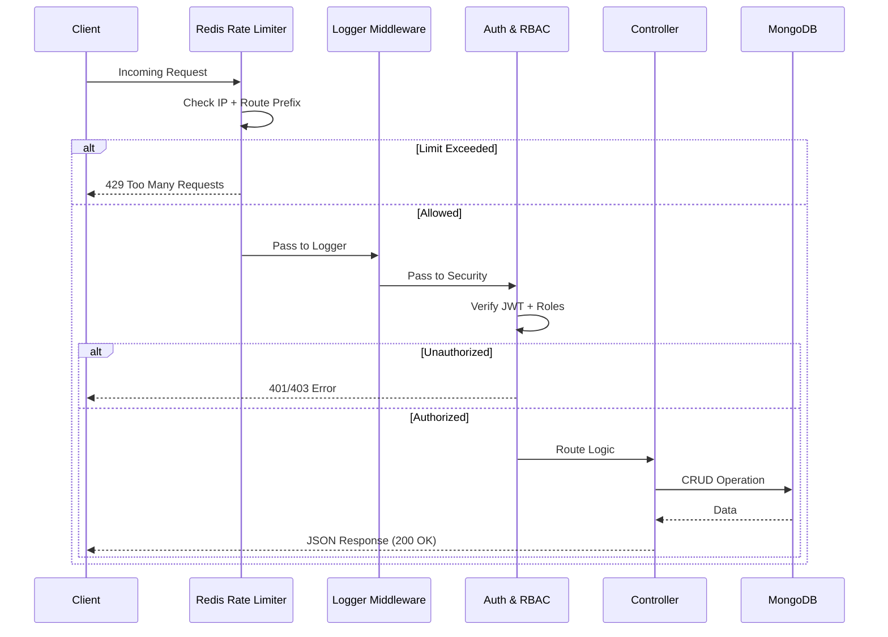

# 🏦 Banking API Engine

A high-performance, secure Backend API built with **Node.js**, **Express**, and **MongoDB**. This project integrates a robust **Redis-backed Rate Limiting** system, ensuring protection against DDoS attacks, brute-force attempts, and resource abuse.

---

## 🌟 Key Features

- **🔐 Secure Authentication**: JWT-based flow with Access and Refresh tokens (stored securely and invalidated on logout).
- **🛡️ Multi-Layered Middleware**:
    - **Logging**: Real-time request/response tracking via Winston.
    - **Security**: CORS, multi-role authorization (RBAC), and IP-based rate limiting.
- **⚡ Redis Acceleration**: Offloads rate limiting to Redis for sub-millisecond overhead and horizontal scalability.
- **📦 Reliable Storage**: Mongoose-based data modeling with automated indexing.
- **🧩 Scalable Architecture**: Domain-driven directory structure for easy maintenance and expansion.

---

## 🏗️ Architecture Overview

The following diagram illustrates how a request flows through the API's security and processing layers:



---

## 🚀 Getting Started

### Prerequisites

- **Node.js**: v20 or higher
- **MongoDB**: Atlas or local instance
- **Redis**: Cloud or local instance (Standard port: 6379, or custom from `.env`)

### Installation

1. **Clone & Install**:
   ```bash
   git clone <repository-url>
   cd <repository-directory>
   pnpm install
   ```

2. **Environment Configuration**:
   Create a `.env` file from the example:
   ```bash
   cp .env.example .env
   ```

   | Variable | Description |
   | :--- | :--- |
   | `MONGO_URI` | Full connection string for MongoDB |
   | `REDIS_HOST` | Hostname of your Redis instance |
   | `REDIS_PORT` | Port of your Redis instance |
   | `REDIS_PASSWORD`| Authentication password for Redis |
   | `JWT_SECRET` | Secret for signing access tokens |
   | `JWT_REFRESH_SECRET` | Secret for signing refresh tokens |

### Execution

- **Development**: `pnpm dev` (Auto-restarts on changes)
- **Production**: `pnpm start` (Optimized start)

---

## 🛡️ Redis Rate Limiting & Security

The API implements `rate-limiter-flexible` with a Redis backend. This architecture is crucial for distributed systems where multiple server nodes share the same limit state.

### Configured Limiters

| Endpoint Prefix | Points (Req) | Duration | Key Prefix | Purpose |
| :--- | :--- | :--- | :--- | :--- |
| `/users/register`, `/users/login` | 5 | 60s | `auth` | Prevent brute-force |
| `/users/me` | 100 | 60s | `profile` | Standard user limit |
| `/users/admin` | 50 | 60s | `admin` | Admin action protection |
| *General* | 5 | 60s | `genericrl` | Default global fallback |

### 429 Response Format
When a user exceeds the limit, the API returns a structured error:
```json
{
  "success": false,
  "message": "Too Many Requests. Please try again later.",
  "retryAfterSeconds": 45
}
```

### Rate Limit Headers (RFC 6585)
All responses include real-time rate limiting metadata:
- `X-RateLimit-Limit`: Maximum requests allowed in the window.
- `X-RateLimit-Remaining`: Remaining points for the current client.
- `X-RateLimit-Reset`: Timestamp for when the limit resets. (Only on 429)
- `Retry-After`: Seconds to wait before retrying. (Only on 429)

---

## 🛣️ API Reference

### 1. Authentication
`POST /users/register`
- **Body**: `{ "fullName": "...", "email": "...", "password": "..." }`
- **Response**: `201 Created`

`POST /users/login`
- **Body**: `{ "email": "...", "password": "..." }`
- **Response**: `200 OK` with JSON containing `access_token` and `refresh_token`.

`POST /users/refresh`
- **Body**: `{ "refresh_token": "..." }`
- **Response**: Generates a new pair of tokens.

### 2. User Profile
`GET /users/me`
- **Headers**: `Authorization: Bearer <token>`
- **Response**: Details of the currently authenticated user.

### 3. Protected Routes (RBAC)
`GET /users/admin`
- **Headers**: `Authorization: Bearer <admin_token>`
- **Roles Required**: `admin` (the user must have at least one of the required roles in their `roles` array)
- **Response**: `200 OK` with a message confirming admin access.

---

## 📂 Directory Structure

```bash
.
├── config/             # Core configurations (Redis, MongoDB, Logger)
├── controllers/        # Logical entry points for routes
├── middleware/         # Security, Rate Limiting, Error handling
├── models/             # Mongoose schemas & data validation
├── routes/             # API route definitions & mapping
├── utils/              # JWT helpers, formatters, constants
├── logs/               # Local log files (app.log, errors.log)
└── index.js            # Main application entry point
```

---

## ✅ Deployment Checklist

1. [ ] Ensure `MONGO_URI` and `REDIS_` credentials are encrypted in your CI/CD.
2. [ ] Set `NODE_ENV=production`.
3. [x] Configure `trust proxy` in `index.js` if deploying behind Load Balancers (AWS ALB, Nginx).
4. [x] Enable `RateLimiterRedis` to avoid "Memory Leaks" associated with local dev in-memory limiters.

---

## 📄 License
This project is licensed under the MIT License.
